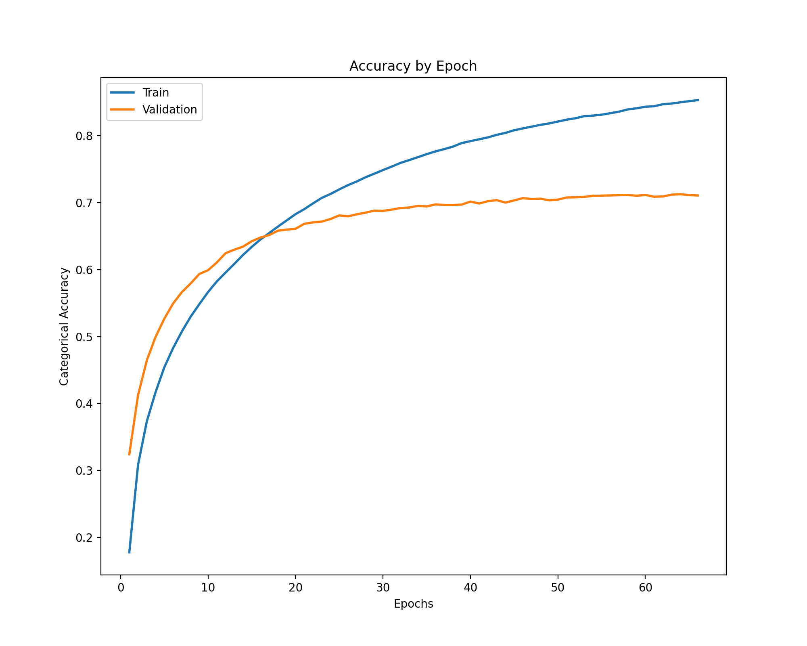
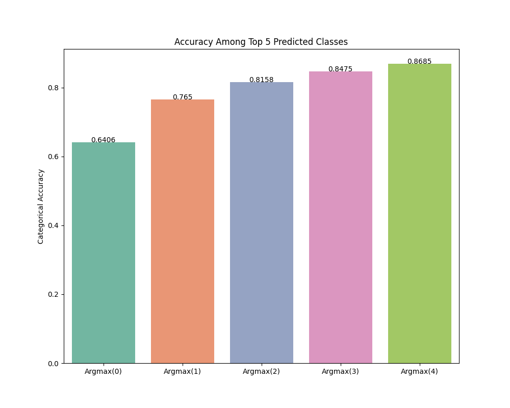

# Table of contents

- [Introduction](#introduction)
- [Quick Start](#quick-start)
    - [Requirements](#requirements)
    - [Getting started](#getting-started)
- [Running the code](#running-the-code)
    - [Training](#training)
    - [Predict](#predict)
- [Code Structure](#code-structure)
- [GPU cluster](#gpu-cluster)
- [Docker](#docker)
- [Run model using Docker](#run-model-using-docker)
- [Vehicle make-model classifier](#vehicle-make-model-classifier)
- [Data](#data)
    - [Training data](#training-data)
      - [Manufacturers in data](#manufacturers-in-data)
      - [How classes are defined](#how-classes-are-defined)
      - [Distribution of images per class](#distribution-of-images-per-class)
    - [Test data](#test-data)
- [Data labels](#data-labels)
- [Results: Best performing model](#results-best-performing-model)
    - [Summary of experiments](#summary-of-experiments)

# Introduction
The code in this repository develops a TensorFlow Keras computer vision model to classify passenger vehicle makes (i.e. manufacturer) and models. 

This vehicle classifier is the *third model* in a three-part image classification pipeline of motor vehicle makes and models: 1) images are output from a thermal camera and supplied to the [trained cGAN model for conversion to the visible spectrum](https://github.boozallencsn.com/MERGEN/GAN); 2) the [YOLOv5 algorithm](https://github.com/ultralytics/yolov5) is used on converted visible images to generate bounding box coordinates around any passenger motor vehicles present in the image; 3) images are cropped to the YOLOv5 bounding box area and the make-model of the vehicle is classified using code in this repository. A mockup of this workflow can be found in the [vehicle_image_pipeline](https://github.boozallencsn.com/MERGEN/vehicle_image_pipeline) repository. The actual image pipeline will be run on an NVIDIA Jetson device and is still in development.

We train our vehicle make-model classifier using a large (n=664,678) dataset of 40 passenger vehicle manufacturers and 574 distinct make-model classes.

# Quick start
### Requirements
- Linux or macOS (may work on Windows, not tested)
- [ideally] NVIDIA GPU; will also work on CPU

### Getting started
Clone this repository

    git clone git@github.boozallencsn.com:MERGEN/vehicle_make_model_classifier.git

Set up Python virtual environment

    pip install -r requirements.txt

Pull Docker image

    docker pull king0759/tf2_gpu_jupyter_mpl:v3

# Running the code

### Training
    python3 MakeModelClassifier.py --train --img-registry=<path> --data=<path> \
        --output=<path> [options*]
*See script for options. Options and requirements differ for train and predict modes

Image paths in the `img-registry` dataframe are expected to be relative paths; these are concatenated to the root data directory supplied by `data`.

Upon execution the script creates a new directory in the output location formatted as `YYYY-MM-DD-HHhmm`, corresponding to the datetime the script was initialized. Once the script is finished, the following subdirectories and files will be in the parent directory:

- `figs`: categorical accuracy and categorical cross-entropy loss metrics by epoch
- `training_checkpoints`: [only if `save-weights`=='true'] saved Keras and Onnx models from last epoch
- `logs`: performance metrics and log file. Specifically:
  - `confusion_matrix.csv`: multiclass confusion matrix
  - `metrics.csv`: accuracy and loss among train and validation sets by epoch
  - `OVR Confusion Matrix.csv`: one vs rest confusion matrix
  - `predicted_classes.csv`: predicted classes per test observation sorted descending by softmax probability
  - `predictions.csv`: softmax probabilities per test observation. Standard output from model.predict()
  - `config.json`: parameters of MakeModelClassifier object when instantiated, containing training parameters
  - `label_mapping.json`: label mapping for softmax probabilities
  - `Log.txt`: log file. This will be continually updated during training, allowing you to view progress
  - `cmc_curve_5.png`: cumulative matching characteristic curve of top 5 softmax probabilities
  - `cmc_curve_50.png`: cumulative matching characteristic curve of top 50 softmax probabilities
  - `heatmap.png`: heatmap of multiclass confusion matrix
  - `model_structure_scaled.png`: figure illustrating model structure, scaled
  - `model_structure.png`: figure illustrating model structure, unscaled
  - `sensitivity_bar.png`: bar graph of 50 best and worst classified classes
  - `sensitivity_kdeplot.png`: kernel density plot of sensitivity across all classes

### Predict
    python3 MakeModelClassifier.py --predict --img-registry=<path> --data=<path> \
        --output=<path> [options*]
*See script for options. Options and requirements differ for train and predict modes

In predict mode, the script creates the `logs` subdirectory and all files as above except: `metrics.csv`, `Log.txt`, and `model_structure*.png`.

# Code structure
### Root dir
- [MakeModelClassifier.py](MakeModelClassifier.py): methods for the MakeModelClass subclass. Primary script used to train the make-model classifier or make predictions using weights from this model
- [core.py](core.py): abstract base class (ABC) superclass containing core methods used by [MakeModelClassifier.py](MakeModelClassifier.py)
- [README.md](README.md): this script, explains the branch of this repository
- [TrainingImageData.md](TrainingImageData.md): fuller explanation of training data
- [Docker_Linux_HELPME.md](Docker_Linux_HELPME.md: useful common commands for Docker and Linux
- [driver.sh](driver.sh): shell script to automate the uploading of other scripts in this branch to the GPU cluster
- [requirements.txt](requirements.txt): contains full list of all dependencies used to implement this code

### [create_test_images](create_test_images)
- [curate_stanford_img_dir.py](./create_test_images/curate_stanford_img_dir.py): curates the Stanford cars dataset, generating image directory
- [curate_thermal_img_dir.py](./create_test_images/curate_thermal_img_dir.py): curates the thermal image dataset, generating image directory

### [create_training_images](create_training_images)
- [get_make_model_db.py](./create_training_images/get_make_model_db.py): queries the back4app database, outputting `./create_training_images/data/make_model_database.csv`

- [restrict_population_make_models.py](./create_training_images/restrict_population_make_models.py): standardizes and fixes some errors in vehicle makes and models, outputting `./create_training_images/data/make_model_database_mod.csv`

- [scrape_vehicle_make_models.py](./create_training_images/scrape_vehicle_make_models.py): scrapes Google Images for each detailed make-model-year combination

- [create_image_directory.py](./create_training_images/create_image_directory.py): ensures non-duplicate and valid URLs and creates the image dataframe that contains a path and label to each JPG image. Outputs image registry

- [yolov5_vehicle_bboxes.py](./create_training_images/yolov5_vehicle_bboxes.py): detects objects in images using [YOLOv5](https://github.com/ultralytics/yolov5) algorithm

- [back4app_database_analysis.ipynb](./create_training_images/analysis/back4app_database_analysis.ipynb): Notebook examining list of vehicle makes and models in [back4app.com](https://www.back4app.com/database/back4app/car-make-model-dataset) database

- [scraped_image_analysis.ipynb](./create_training_images/analyses/scraped_image_analysis.ipynb): Examines distributions of scraped images

### [results](results)
- [TestSetAnalysis.ipynb](./results/TestSetAnalysis.ipynb): Examines model performance by make-model class using a holdout set from our training images    

***TODO***

### [tests](tests)
- [onnx_keras_weights.ipynb](./tests/onnx_keras_weights.ipynb): performs formal statistical test that softmax probabilities output by original TensorFlow Keras model are very close to Onnx weights

### [YOLOv5](yolov5)
This is a Git submodule for the [YOLOv5](https://github.com/ultralytics/yolov5) repository

# GPU cluster 
We use Booz Allen's Westborough CSN cluster, which runs has 4 GeForce RTX 2080 Ti GPUs. The UUIDs for these GPUs, which allow runs on specific GPUs, are:

- GPU 0: GPU-8121da2f-b1c3-d231-a9ab-7d6f598ba2dd
- GPU 1: GPU-7a7c102c-5f71-a0fd-2ac0-f45a63c82dc5
- GPU 2: GPU-0c5076b3-fe4a-0cd8-e4b7-71c2037933c0
- GPU 3: GPU-3c51591d-cfdb-f87c-ece8-8dcfdc81e67a

Training are stored on the cluster at `/home/kingj/scraped_images`. Currently, no test data are stored on the GPU server.

# Docker
We train the GAN models in a Docker container (see [this link](https://docs.docker.com/get-started/overview/) for information on Docker). Also see [Docker_Linux_HELPME.md](Docker_Linux_HELPME.md) for useful Docker and Linux commands. Containers create separate environments from the operating system, so training data and scripts must be moved into the container. Two options exist: create a [Docker volume](https://docs.docker.com/storage/volumes/) (preferred) that persists beyond the life of the container, or mount the data/scripts when the container is instantiated. Directly-mounted data/scripts do not persist beyond the life of the container.

### Data volume
This has been removed to save HD space. To re-create this follow the instructions to create new docker volume in [Docker_Linux_HELPME](Docker_Linux_HELPME.md)

### Model output volume
This has been removed to save HD space. To re-create this follow the instructions to create new empty docker volume in [Docker_Linux_HELPME](Docker_Linux_HELPME.md)

### Docker image
For this code, as well as the GAN model, the following image was used:

    king0759/tf2_gpu_jupyter_mpl:v3

This (admittedly bloated) Docker image contains the packages listed in `requirements.txt`. Not all of the packages listed in this requirements file are strictly necessary for the code in this repository though.

# Run model using Docker
To run the classifier using an ResNet50 layer, for example, in a detached Docker container, enter:

## Training example
    docker run -it \
        --name make_model_classifier \
        --rm -d \
        --mount type=bind,source=/home/kingj/scripts,target=/scripts \
        --mount source=MERGEN_Make_Model_data,target=/data \
        --mount source=MERGEN_Make_Model_output,target=/output \
        --gpus device=GPU-7a7c102c-5f71-a0fd-2ac0-f45a63c82dc5 \
        king0759/tf2_gpu_jupyter_mpl:v3 python3 ./scripts/MakeModelClassifier.py \
        --train --data=/data --img-registry=/scripts/Bboxes.csv --epochs=130 \
        --output=/output --logging='true' --save-weights='true' --dropout=0.25 \
        --patience=10 --batch-size=256 --units2=4096 --units1=2048 \
        --model='resnet' --resnet-size='50' --min-class-img-count=0 \
        --learning-rate=0.0001 --optimizer='adam'

### Explanation
- `docker run`: starts a new container
- `-it`: runs the container in interactive mode
- `--name make_model_classifier`: specifies the container name as 'make_model_classifier'
- `-d`: run the container detached. To work interactively in the container omit this
- `--rm`: removes the container at the end of execution. Note - since output is stored in a volume this persists beyond the life of the container. It's also good practice to remove containers you're not using to reduce HD space
- `--mount type=bind,source=/home/kingj/scripts,target=/scripts`: directly mount the `/home/kingj/scripts` directory, as `/scripts` within the container. Change the source and target directories as needed
- `--mount source=MERGEN_Make_Model_data,target=/data`: mounts the now deleted data volume, `MERGEN_Make_Model_data` as `/data` within the container
- `--mount source=MERGEN_Make_Model_output,target=/output`: mounts the now deleted output volume
- `--gpus device=GPU-3c51591d-cfdb-f87c-ece8-8dcfdc81e67a`: Specifies a particular GPU to use. To use all GPUs change this to `--gpus all`
- `king0759/tf2_gpu_jupyter_mpl:v3`: container image. If not stored locally this will be downloaded from Docker Hub
- `python3`: specifies the container should be instantated using Python. To instead instantiate using Bash enter `/bin/bash` or omit entirely (this is the default for this Docker image). Note - the software available in a container depends on the container image
- `./scripts/MakeModelClassifier.py --train --data=/data --img-registry=/scripts/Bboxes.csv --epochs=130 --output=/output --logging='true' --save-weights='true' --dropout=0.25 --patience=10 --batch-size=256 --units2=4096 --units1=2048 --model='resnet' --resnet-size='50' --min-class-img-count=0 --learning-rate=0.0001 --optimizer='adam'`: instructs the container to train the model with the supplied arguments. If this is omitted the container will simply instantiate with the default or supplied program (i.e. Python or Bash) and await input

# Vehicle make-model classifier
Compared to object detection, interest and research in vehicle classification lags significantly. Several small-scale research projects can be found via Google (e.g. [example 1](https://towardsdatascience.com/car-model-classification-e1ff09573f4f), [example 2](https://medium.com/@sridatta0808/deep-learning-based-vehicle-make-model-mmr-classification-on-carconnection-dataset-9bc93997041f)) and at least [one company](http://spectrico.com/car-make-model-recognition.html) offers commercial products. Based in part on the former research projects, we opted to build our own vehicle make-model classifier as this enabled us to customize to our particular need.

We use a pretrained TensorFlow Keras [ResNet50v2](https://arxiv.org/abs/1603.05027) layer, which was trained using [ImageNet](https://www.image-net.org/), a large open-source image dataset consisting of 1,000+ distinct classes. We remove the top output layer of ResNet50v2, substituting this with our own trainable layers (described below). We also conducted several experiments varying, among other things, the pretrained layer and top model architecture (described below).

# Data
## Training data
A fuller description of the training image dataset, how it was constructed, and statistical moments can be found in [TrainingImageData.md](TrainingImageData.md).

We were unable to find a sufficiently-large (>500k) publicly-available image dataset, so we created our own. This not only ensures we have sufficient images per class, but also that the training set is **representative of common passenger vehicles currently found on U.S. streets**. By contrast, we do not expect our test sets to be as representative for reasons described below.

We scrape Google Images to create our training image dataset of passenger vehicles (including coupes, sedans, hatchbacks, SUVs, convertibles, wagons, vans, and pickups), which is representative of foreign and domestic vehicles sold in the U.S. market in 2000-2022. This does not include exotic vehicles or heavy-duty work vehicles. We obtained this list of vehicles sold in the U.S. during this period from the [back4app.com](https://www.back4app.com/database/back4app/car-make-model-dataset) database, an open-source dataset providing detailed information about motor vehicles sold in the U.S. in recent decades.

Non-augmented, original images are stored in the MERGEN OneDrive Data folder [here](https://boozallen.sharepoint.com/:u:/r/sites/MERGEN/Shared%20Documents/Data/scraped_images.zip?csf=1&web=1&e=pR2BPO).

### Image augmentation
At training time we apply image augmentation to the training images only. Specifically, we apply random flipping, random brightness, random contrast, randomly convert 50% of images to grayscale (and back to 3-channels to ensure data shape consistency), random hue, and random saturation. Validation and test sets remain non-augmented, original images. Images are not preprocessed prior to read-in.

### Manufacturers in data
We make several sample restrictions (see [TrainingImageData.md](TrainingImageData.md)), yielding the following 40 manufacturers and 574 distinct make-models as our final analytic training set.

| Manufacturer | Years in Database | Number of Models |
| --------- | ----- | ------- |
| Acura | 2000-2022 | 13 
| Audi | 2000-2021 | 26
| BMW | 2000-2021 | 27
| Buick | 2000-2021 | 14
| Cadillac | 2000-2021 | 19
| Chevrolet | 2000-2022 | 38
| Chrysler | 2000-2021 | 14
| Dodge | 2000-2021 | 18
| Fiat | 2012-2021 | 2
| Ford | 2000-2021 | 28
| GMC | 2000-2022 | 11
| HUMMER | 2000-2010 | 4
| Honda | 2000-2022 | 17
| Hyundai | 2000-2022 | 18
| INFINITI | 2000-2021 | 17
| Jaguar | 2000-2021 | 10
| Jeep | 2000-2022 | 9
| Kia | 2000-2022 | 19
| Land Rover | 2000-2021 | 6
| Lexus | 2000-2021 | 15
| Lincoln | 2000-2021 | 15
| MINI | 2002-2020 | 8
| Mazda | 2000-2021  | 18
| Mercedes-Benz | 2000-2022 | 28
| Mercury | 2000-2011 | 11
| Mitsubishi | 2000-2022 | 11 
| Nissan | 2000-2022  | 20
| Pontiac | 2000-2010 | 15
| Porsche | 2000-2021 | 11
| RAM | 2011-2021 | 4
| Saab | 2000-2011 | 5
| Saturn | 2000-2010 | 9
| Scion | 2004-2016 | 8
| Subaru | 2000-2022  | 12
| Suzuki | 2000-2013 |  12
| Tesla | 2012-2021 | 3
| Toyota | 2000-2021  | 24 
| Volkswagen | 2000-2022 | 18 
| Volvo | 2000-2021 | 16
| smart | 2008-2018 | 1

### How classes are defined
We define a class as a string concatenation of make and model. This entails pooling all years a particular make-model was manufactured. Alternatively, we could treat each make-model-year a distinct class. We opted for the former for several reasons. 

1. Concatenating the year dimension would drastically increase the number of classes for the model to predict, from 574 to 5,287
   
2. This would require significantly more data to ensure adequate image counts per class
   
3. On the one hand, variation *within* make-models over time due to generational updates may degrade predictions. On the other, however, this may pale in comparison to differences *between* make-models. [Multivariate regression analyses](https://github.boozallencsn.com/MERGEN/vehicle_make_model_classifier/blob/main/results/TestSetAnalysis.ipynb) of a holdout set from our training images suggest the number of distinct years per make-model is not significantly related to differences in the F1-score, suggesting pooling years does not harm performance

Another more promising strategy would be to group make-models into vehicle generations. We looked into this possibility; however, we found no readily-available datasets containing this information. Given the project timeline and budget, we decided against this.

### Distribution of images per class
The table below describes the distribution of training images per class in our final analytic sample.

| Statistic | Value |
| --------- | ----- |
| Classes   | 574   |
| Mean      | 889.75 |
| std       | 980.07 |
| min       | 56.00  |
| 5%        | 109.00 |
| 10%       | 149.00 |
| 25%       | 287.75 |
| 50%       | 557.00 |
| 75%       | 1117.75 |
| 90%       | 1908.40 |
| 95%       | 7821.00 |
| max       | 7821.00 |

## Test data
We use the [Stanford cars dataset](https://www.kaggle.com/jessicali9530/stanford-cars-dataset) as our primary test set. These data are stored in the MERGEN OneDrive Data folder [here](https://boozallen.sharepoint.com/:u:/r/sites/MERGEN/Shared%20Documents/Data/stanford_car_data.zip?csf=1&web=1&e=KAXaUy) and were downloaded from Kaggle.com. Originally containing 16,185 images on 196 make-model classes spanning 2001-2012, we restrict to overlapping vehicle make-models with our training set. Net of these restrictions, this left us with 124 distinct classes and  12,596 test images. We do not expect this dataset to be representative of current U.S. vehicles as it's outdated. It's also unclear how this dataset was assembled.

Our second test set is a small (1,820) image dataset of matched thermal and visible images with hand-curated make-model classes. These data were collected by Booz Allen employees around several parking lots in the DC-Maryland-Virginia area. Unfortunately, they only contain 11 make-models that overlap with our training data. These data can be found in the MERGEN OneDrive Data folder [here](https://boozallen.sharepoint.com/:u:/r/sites/MERGEN/Shared%20Documents/Data/Thermal-Visible%20Make-Model%20Test%20Images.zip?csf=1&web=1&e=CFWpew). We do not expect this dataset to be representative of current U.S. vehicles as it was a convenience sample, i.e. vehicles parked in large parking lots around the DC-Maryland-Virginia area. The images are also not independent; they were gathered by a high-speed camera driving slowly in parking lots. Correspondingly, many of the images are of the *same* vehicle.

# Class labels
Make-model class labels are built into the nested make->model->year directory structure of our training set. Rather than directly using this directory structure, we create a **CSV file containing the relative path to each image along with its label**. We call this dataframe the **image registry** or `img-registry`. We also use this CSV file to hold the YOLOv5 bounding box coordinates for each image. Using this external CSV allows us to generate bounding boxes once ahead of time and save them, rather than generating them on-the-fly each time an image enters the make-model classifier pipeline. A zip file of these registries is also found [here](https://boozallen.sharepoint.com/:u:/r/sites/MERGEN/Shared%20Documents/Data/image_registries.zip?csf=1&web=1&e=54ZNnT).

### Labels and bounding box info
- `./image_registries/Bboxes.csv`: training set
- `./image_registries/Stanford_Bboxes_xl.csv`: Stanford dataset
- `./image_registries/Bboxes_xl_test_thermal.csv`: thermal test images
  - `./image_registries/Bboxes_xl_test_visible.csv`: matched visible test images 

# Results: Best performing model
### Model parameters

- Optimizer: Adam
- YOLOv5 XL
- YOLOv5 minimum confidence threshold: 0.50
- Minimum YOLOv5 bounding box area: 8,911 pixels (1st percentile)
- Batch size: 256
- ResNet50V2
- GlobalAveragePooling2D
- Dropout rate: 0.2
- Dense layers: 4096 x 2048 units
- Bounding box dilation: 5px
- Max training epochs: 130
- Early stopping patience: 10 epochs
- Learning rate: 0.0001
- Minimum training images per class: 0
- Total classes: 574

### Categorical accuracy by epoch

### Categorical cross-entropy loss by epoch

Note: A more extensive analysis of performance in the test set can be viewed in the notebook at [TestSetAnalysis.ipynb](./results/TestSetAnalysis.ipynb).

### Summary of experiments
The following table contains results from a host of recent experiments to find the optimal model given our training data. In particular, number 14 is our best performing model.

| Number | Pretrained Model | # Classes | Dense Layers | Dropout Rate | YOLOv5 Model** | Test Argmax(0) | Test Argmax(0:4) | Stanford Argmax(0) | Stanford Argmax(0:4) |
| ------ | ---------------- | --------- | ------------ | ------------ | ------------ | -------------- | ---------------- | ------------------ | -------------------- |
|1 | Xception | 552 | 512 | 0.05 | small | 0.4409 | 0.7184 |
|2 | ResNet101V2 | 552 | 512 | 0.05 | small | 0.6031 | 0.8406 |
|3 | ResNet101V2 | 574 | 512 | 0.05 | small | 0.6027 | 0.8365 |
|4 | ResNet101V2 | 477 | 512 | 0.05 | small | 0.6192 | 0.8495 |
|5 | ResNet101V2 | 352 | 512 | 0.05 | small | 0.6348 | 0.8637 |
|6 | Inception | 574 | 512 | 0.05 | small | 0.4616 | 0.7272 |
|7 | ResNet152V2 | 574 | 512 | 0.05 | small | 0.6113 | 0.8440 | 
|8 | ResNet101V2 | 574 | 1024 | 0.05 | small | 0.6282 | 0.8499 |
|9 | ResNet101V2 | 574 | 1024 x 1024 | 0.05 | small | 0.6431 | 0.8679 |
|10 | MobileNetV2 | 574 | 1024 x 1024 | 0.05 | small | 0.4277 | 0.7089 |
|11 | ResNet50V2 | 574 | 2048 x 1024 | 0.1 | small | 0.6614 | 0.8756 | 0.5996 | 0.8218 |
|12 | ResNet50V2 | 574 | 4096 x 2048 | 0.2 | small | 0.6896 | 0.8887 | 0.5918 | 0.8253 |
|13 | ResNet50V2 | 574 | 8192 x 4096 | 0.25 | small | 0.6804 | 0.8834 | 0.5900 | 0.8211 |
|14 | ResNet50V2 | 574 | 4096 x 2048 | 0.2 | xl | 0.7067 | 0.9092 | 0.6406 | 0.8685 |

All models trained using the Adam optimizer, a learning rate of 0.0001, max epochs of between 130-200 epochs with early stopping after 10 epochs, and a batch size of 256.   
** small YOLOv5 model trained using minimum bounding box area of 3,731 pixels (5th percentile) and minimum confidence of 0.50  
** xl YOLOv5 model trained using a minimum bounding box area of 8,911 pixels (1st percentile) and minimum confidence of 0.50  

### Cumulative matching characteristic curve top 5

### Cumulative matching characteristic curve top 50

### 50 best and worst classified classes

### Test set performance: using [Stanford car dataset](https://www.kaggle.com/jessicali9530/stanford-cars-dataset)
