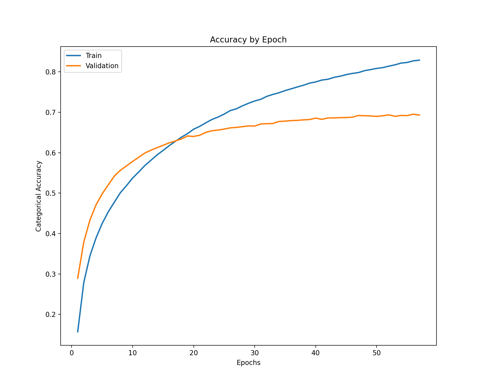
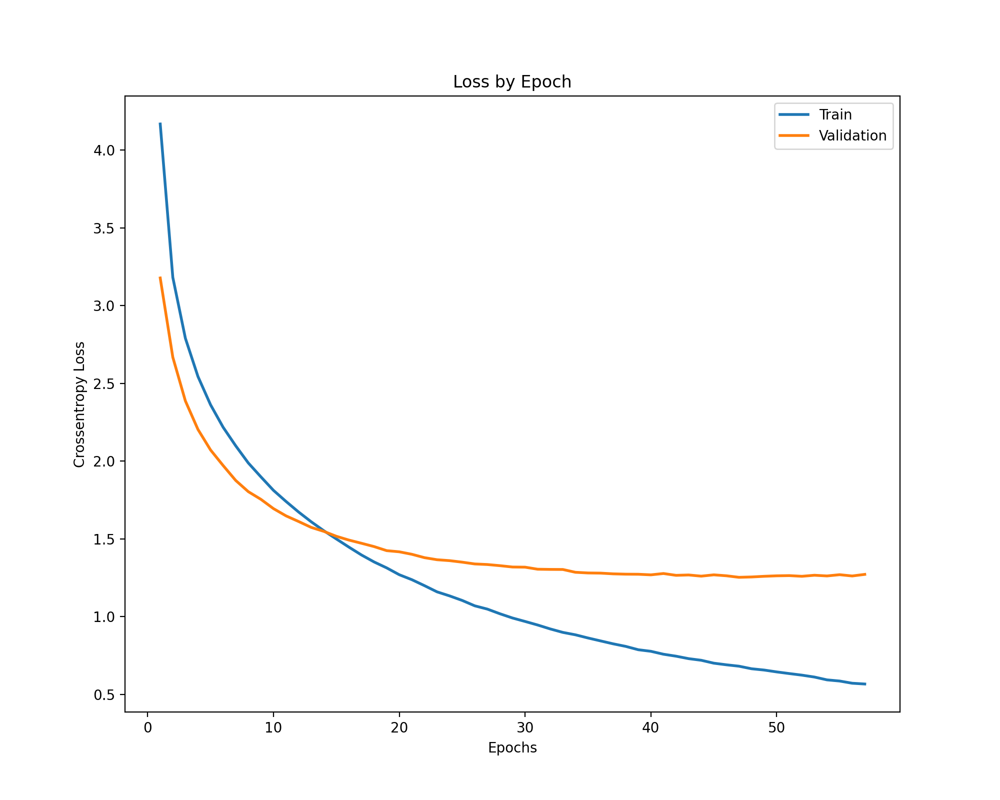
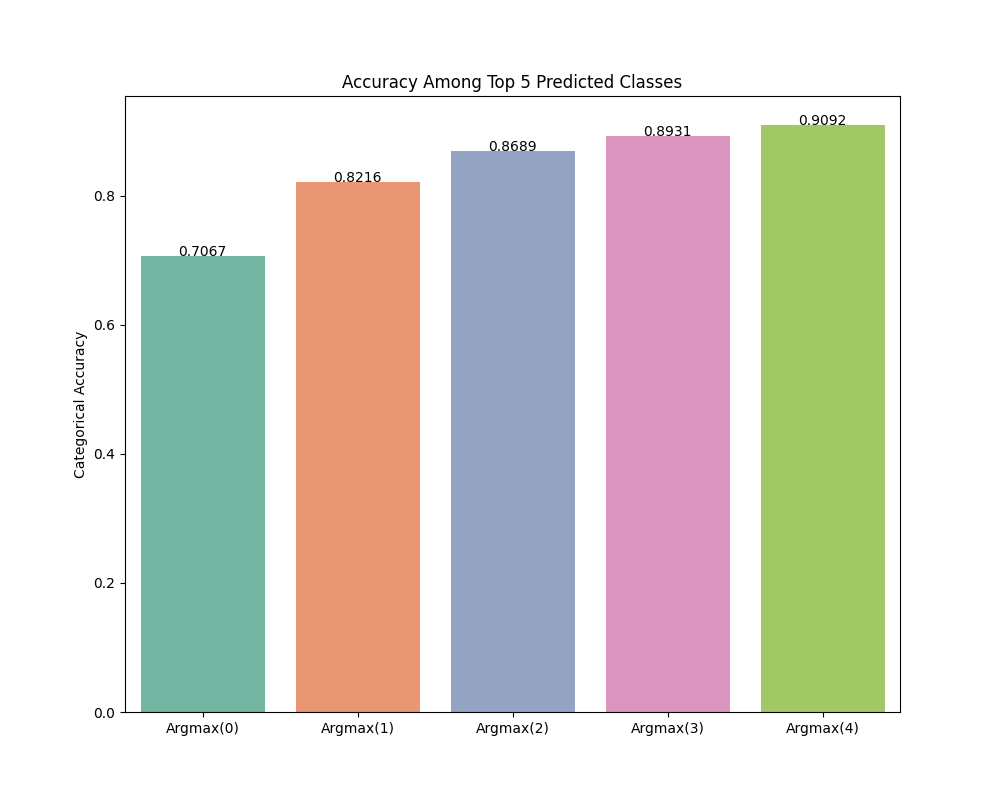
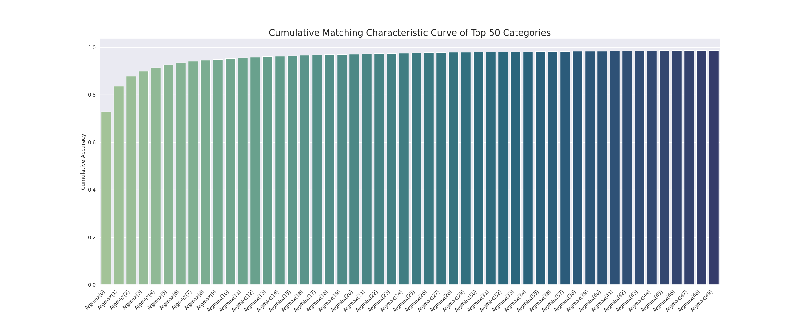
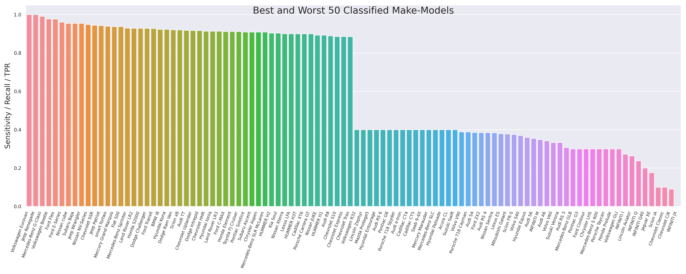

# Introduction
The code in this repository develops a computer vision model to classify passenger vehicle makes (i.e. manufacturer) and models. 

This vehicle classifier is the *third model* in a three-part image classification pipeline of motor vehicle makes and models: 1) images are output from a thermal camera and supplied to the [trained cGAN model for conversion to the visible spectrum](https://github.boozallencsn.com/MERGEN/GAN); 2) the [YOLOv5 algorithm](https://github.com/ultralytics/yolov5) is used on converted visible images to generate bounding box coordinates around any passenger motor vehicles present in the image; 3) images are cropped to the YOLOv5 bounding box area and the make-model of the vehicle is classified using code in this repository. A mockup of this workflow can be found in the [vehicle_image_pipeline](https://github.boozallencsn.com/MERGEN/vehicle_image_pipeline) repository. The actual image pipeline will be run on an NVIDIA Jetson device and is still in development.

We train our vehicle make-model classifier using a large (n=664,678) dataset of 40 passenger vehicle manufacturers and 574 distinct make-models.

# Repository branches
- `main` **[this branch]**: code to create our training dataset as well as code to create and train make-model classifier model
- `combine_stanford_vmmr`: older branch that merged vehicle images from the [Stanford cars dataset](https://www.kaggle.com/jessicali9530/stanford-cars-dataset) with the [VMMR database](https://github.com/faezetta/VMMRdb). Because of the size and questionable representativeness of these datasets, we opted to create our own image dataset
- `tf_distributed`: older branch in which we distributed training of the TensorFlow Keras model across GPUs. For simplicity we opted for training on one GPU

# Vehicle make-model classifier
Compared to object detection, interest and research in vehicle classification lags significantly. Several small-scale research projects can be found via Google (e.g. [example 1](https://towardsdatascience.com/car-model-classification-e1ff09573f4f), [example 2](https://medium.com/@sridatta0808/deep-learning-based-vehicle-make-model-mmr-classification-on-carconnection-dataset-9bc93997041f)) and at least [one company](http://spectrico.com/car-make-model-recognition.html) offers commercial products. Based in part on the former research projects, we opted to build our own vehicle make-model classifier as this enabled us to customize to our particular need.

We use a pretrained Tensorflow Keras [ResNet50v2](https://arxiv.org/abs/1603.05027) layer, which was trained using [ImageNet](https://www.image-net.org/), a large open-source image dataset consisting of 1,000+ distinct classes. We remove the top output layer of ResNet50v2, substituting this with our own trainable layers (described below). We also conducted several experiments varying, among other things, the pretrained layer and top model architecture (described below).

# Data
A fuller description of the training image dataset, how it was constructed, and statistical moments can be found in `TrainingImageData.md`. We scrape Google Images to create our training image dataset of passenger vehicles (including coupes, sedans, hatchbacks, SUVs, convertibles, wagons, vans, and pickups), which is representative of foreign and domestic vehicles sold in the U.S. market in 2000-2022. This does not include exotic vehicles or heavy-duty work vehicles. We obtained this list of vehicles sold in the U.S. during this period from the [back4app.com](https://www.back4app.com/database/back4app/car-make-model-dataset) database, an open-source dataset providing detailed information about motor vehicles sold in the U.S. in recent decades.

## Manufacturers in data
We make several sample restrictions (see `TrainingImageData.md`), yielding the following 40 manufacturers and 574 distinct make-models as our final analytic training set.

| Manufacturer | Years in Database | Number of Models |
| --------- | ----- | ------- |
| Acura | 2000-2022 | 13 
| Audi | 2000-2021 | 26
| BMW | 2000-2021 | 27
| Buick | 2000-2021 | 14
| Cadillac | 2000-2021 | 19
| Chevrolet | 2000-2022 | 38
| Chrysler | 2000-2021 | 14
| Dodge | 2000-2021 | 18
| Fiat | 2012-2021 | 2
| Ford | 2000-2021 | 28
| GMC | 2000-2022 | 11
| HUMMER | 2000-2010 | 4
| Honda | 2000-2022 | 17
| Hyundai | 2000-2022 | 18
| INFINITI | 2000-2021 | 17
| Jaguar | 2000-2021 | 10
| Jeep | 2000-2022 | 9
| Kia | 2000-2022 | 19
| Land Rover | 2000-2021 | 6
| Lexus | 2000-2021 | 15
| Lincoln | 2000-2021 | 15
| MINI | 2002-2020 | 8
| Mazda | 2000-2021  | 18
| Mercedes-Benz | 2000-2022 | 28
| Mercury | 2000-2011 | 11
| Mitsubishi | 2000-2022 | 11 
| Nissan | 2000-2022  | 20
| Pontiac | 2000-2010 | 15
| Porsche | 2000-2021 | 11
| RAM | 2011-2021 | 4
| Saab | 2000-2011 | 5
| Saturn | 2000-2010 | 9
| Scion | 2004-2016 | 8
| Subaru | 2000-2022  | 12
| Suzuki | 2000-2013 |  12
| Tesla | 2012-2021 | 3
| Toyota | 2000-2021  | 24 
| Volkswagen | 2000-2022 | 18 
| Volvo | 2000-2021 | 16
| smart | 2008-2018 | 1

## Number of images per make-model
The table below describes the distribution of training images per class in our final analytic sample.

| Statistic | Value |
| --------- | ----- |
| Classes   | 574   |
| Mean      | 889.75 |
| std       | 980.07 |
| min       | 56.00  |
| 5%        | 109.00 |
| 10%       | 149.00 |
| 25%       | 287.75 |
| 50%       | 557.00 |
| 75%       | 1117.75 |
| 90%       | 1908.40 |
| 95%       | 7821.00 |
| max       | 7821.00 |

# Pipeline to Train the Make-Model Classifier
We develop code locally on our local laptop and upload updated scripts to the GPU cluster to execute code. To upload the scripts that run the make-model classifier, `MakeModelClassifier.py` and `core.py`, along with the image directory `./data/Bboxes.csv` enter in your console:

    sh driver.sh

Code will be copied onto the working directory for your profile on the GPU in a directory called `scripts`.

### Data on the GPU cluster
The training data described above are stored in a Docker volume called `MERGEN_Make_Model_data`. Images are also stored outside of Docker on the cluster at `/home/kingj/scraped_images`.

### Model output
Results from running `MakeModelClassifier.py` are stored in a Docker volume called `MERGEN_Make_Model_output`.

### CSV file to associate images with labels
A CSV file containing paths to each JPG image, YOLOv5 bounding box coordinates, make-model class labels, and image dimensions is stored locally at `./data/Bboxes.csv`. At training time we use this CSV to link each image (a string path, in this dataframe) to its associated label and bounding box coordinates. ***We do not pre-crop images down to their YOLOv5 XL bounding box; instead, images are cropped as they are streamed in the training process***. The make-model classifier is trained using cropped cropped images, though we dilate these bounding boxes by 5px as YOLOv5 bounding boxes tend to be tightly cropped.

### Run the classifier
To run the classifier using an ResNet50 layer, for example, in a detached Docker container, enter:

    docker run -it \
        --name make_model_classifier \
        --rm -d \
        --mount type=bind,source=/home/kingj/scripts,target=/scripts \
        --mount source=MERGEN_Make_Model_data,target=/data \
        --mount source=MERGEN_Make_Model_output,target=/output \
        --gpus device=GPU-7a7c102c-5f71-a0fd-2ac0-f45a63c82dc5 \
        king0759/tf2_gpu_jupyter_mpl:v3 python3 ./scripts/MakeModelClassifier.py \
        --train --data=/data --epochs=130 --output=/output --logging='true' \
        --save-weights='true' --dropout=0.25 --patience=10 --batch-size=256 \
        --units2=4096 --units1=2048 --model='resnet' --resnet-size='50' \
        --min-class-img-count=0 --learning-rate=0.0001 --optimizer='adam'

The Docker image `king0759/tf2_gpu_jupyter_mpl:3` contains all the dependent modules. Importantly, you will need to update the mount source above to the scripts directory on your working directory, if you make changes to these scripts.You should also select one or more GPU to designate for your container:

- GPU-8121da2f-b1c3-d231-a9ab-7d6f598ba2dd
- GPU-7a7c102c-5f71-a0fd-2ac0-f45a63c82dc5
- GPU-0c5076b3-fe4a-0cd8-e4b7-71c2037933c0)
- GPU-3c51591d-cfdb-f87c-ece8-8dcfdc81e67a

These are the unique identifiers for GPUs 0-3, respectively. To see which GPUs are free and which are being used type `nvidia-smi`. Their listed order corresponds to the above.

# Results
### Best performing model

- Framework: TensorFlow Keras
- Optimizer: Adam
- YOLOv5 XL
- YOLOv5 minimum confidence threshold: 0.50
- Minimum YOLOv5 bounding box area: 8,911 pixels (1st percentile)
- Batch size: 256
- ResNet50V2
- GlobalAveragePooling2D
- Dropout rate: 0.2
- Dense layers: 4096 x 2048 units
- Bounding box dilation: 5px
- Max training epochs: 130
- Early stopping patience: 10 epochs
- Learning rate: 0.0001
- Minimum training images per class: 0
- Total classes: 574

- A more extensive analysis of performance in the test set can be viewed in the notebook at `./results/TestSetAnalysis.ipynb`.
   
- The following table contains results from a host of recent experiments to find the optimal model given our training data. In particular number 14 is our best performing model.

| Number | Pretrained Model | # Classes | Dense Layers | Dropout Rate | YOLOv5 Model** | Test Argmax(0) | Test Argmax(0:4) | Stanford Argmax(0) | Stanford Argmax(0:4) |
| ------ | ---------------- | --------- | ------------ | ------------ | ------------ | -------------- | ---------------- | ------------------ | -------------------- |
|1 | Xception | 552 | 512 | 0.05 | small | 0.4409 | 0.7184 |
|2 | ResNet101V2 | 552 | 512 | 0.05 | small | 0.6031 | 0.8406 |
|3 | ResNet101V2 | 574 | 512 | 0.05 | small | 0.6027 | 0.8365 |
|4 | ResNet101V2 | 477 | 512 | 0.05 | small | 0.6192 | 0.8495 |
|5 | ResNet101V2 | 352 | 512 | 0.05 | small | 0.6348 | 0.8637 |
|6 | Inception | 574 | 512 | 0.05 | small | 0.4616 | 0.7272 |
|7 | ResNet152V2 | 574 | 512 | 0.05 | small | 0.6113 | 0.8440 | 
|8 | ResNet101V2 | 574 | 1024 | 0.05 | small | 0.6282 | 0.8499 |
|9 | ResNet101V2 | 574 | 1024 x 1024 | 0.05 | small | 0.6431 | 0.8679 |
|10 | MobileNetV2 | 574 | 1024 x 1024 | 0.05 | small | 0.4277 | 0.7089 |
|11 | ResNet50V2 | 574 | 2048 x 1024 | 0.1 | small | 0.6614 | 0.8756 | 0.5996 | 0.8218 |
|12 | ResNet50V2 | 574 | 4096 x 2048 | 0.2 | small | 0.6896 | 0.8887 | 0.5918 | 0.8253 |
|13 | ResNet50V2 | 574 | 8192 x 4096 | 0.25 | small | 0.6804 | 0.8834 | 0.5900 | 0.8211 |
|14 | ResNet50V2 | 574 | 4096 x 2048 | 0.2 | xl | 0.7067 | 0.9092 | 0.6406 | 0.8685 |

All models trained using the Adam optimizer, a learning rate of 0.0001, max epochs of between 130-200 epochs with early stopping after 10 epochs, and a batch size of 256.   
** small YOLOv5 model trained using minimum bounding box area of 3,731 pixels (5th percentile) and minimum confidence of 0.5.  
** xl YOLOv5 model trained using a minimum bounding box area of 8,911 pixels (1st percentile) and minimum confidence of 0.50  
   

   

   

### External validity
We employ a second set of test images from the [Stanford car dataset](https://www.kaggle.com/jessicali9530/stanford-cars-dataset) to evaluate the generalizability of our model. This dataset contains 16,185 images and 196 classes, though only 124 classes overlap with our scraped images. The Stanford images are likewise dated, with the newest make-model being from 2012. Nonetheless, our model performs comparably with these data as with an unseen test subset from our original data (see table above). The CSV image dataframe for these data was curated via `./create_test_images/curate_stanford_img_dir.py`. The YOLOv5 model used for these data are the same as that indicated by the "YOLOv5 Model" column in the table above.